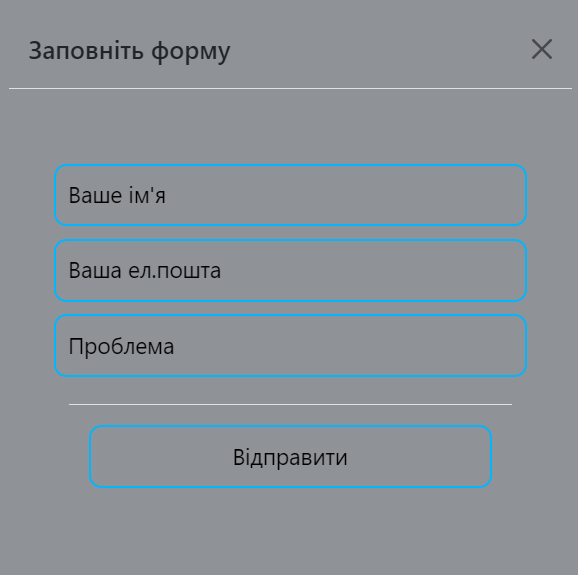
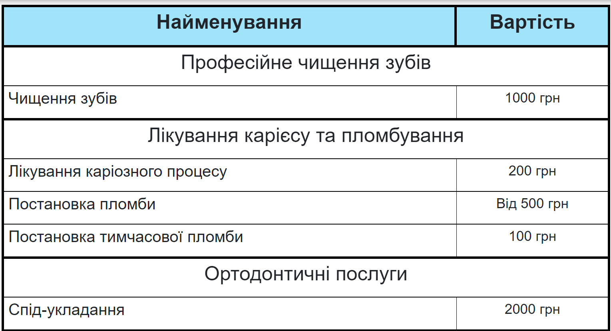

# Dentist Clinic

Dentist Clinic — це проект написанний на мові програмування Python та фреймворці Django, створений командою з 4 розробників як випускний іспит для курсу Full Stack Development. Цей проект – це веб-сайт, який забезпечує пацієнтів інформацією про клініку та послуги, дозволяє швидко вирішити проблему, надіславши лист на електронну пошту спеціалістам та отримувати консультації.

## Швидка карта файлу
- [Dentist Clinic](#dentist-clinic)
  - [Швидка карта файлу](#швидка-карта-файлу)
  - [Учасники проекту](#учасники-проекту)
  - [Технології](#технології)
  - [Сторінки](#сторінки)
  - [Структура проекту](#структура-проекту)
  - [Початок роботи](#початок-роботи)
- [Додаткові налаштування проекту](#додаткові-налаштування-проекту)
- [Моделі, використані у проекті](#моделі-використані-у-проекті)
  - [Category](#category)
  - [Service](#service)
- [Функції, використані у проекті](#функції-використані-у-проекті)
  - [Registration](#registration)
  - [Authorization](#authorization)
  - [Logout](#logout)
  - [Main](#main)
  - [Price](#price)
- [Використання javascript у проекті](#використання-javascript-у-проекті)
  - [Javascript в реєстрації](#javascript-в-реєстрації)
  - [Javascript в авторизації](#javascript-в-авторизації)
- [Файл .gitignore](#файл-gitignore)

## Учасники проекту

1. Уляна Шамільова (Team Lead)
   
   - GitHub профіль: [UlyanaShamilova](https://github.com/UlyanaShamilova)
   
   - Figma проект: [Figma Project](https://www.figma.com/design/v8zsIeGGLNxgXN4j9VlyQQ/Untitled?node-id=0-1&t=M0h7vMHDwMcdirco-1)
   
   - FigJam проект: [FigJam Project](https://www.figma.com/board/uzB60e2o9Mh5KEZgq40tmA/Untitled?node-id=0-1&t=5ciEY9J7BZFZBO1C-1)
   
3. Павло Устич (Full Stack Developer)
   
   - GitHub профіль: [pavel-ustych-v](https://github.com/pavel-ustych-v)
   
   - Figma проект: [Figma Project](https://www.figma.com/design/iOp7LH5dnMdAzAsNeNc1YB/Dentists---project?t=BL1WdQzrCKhPzmMH-1)
   
    - FigJam проект: [FigJam Project](https://www.figma.com/board/rGsSmSDPyRF65GE1lg5KHn/Untitled?t=BL1WdQzrCKhPzmMH-1)
   
5. Назар Зозуля (Full Stack Developer)
   
   - GitHub профіль: [Nazar-Zozulya](https://github.com/Nazar-Zozulya)
   
   - Figma проект: [Figma Project](https://www.figma.com/design/U7j60sky15Ah4svZ5OkjAv/%D0%97%D0%B4%D0%BE%D1%80%D0%BE%D0%B2%D0%B0-%D0%BF%D0%BE%D1%81%D0%BC%D1%96%D1%88%D0%BA%D0%B0?node-id=0-1&t=YX774ACYa85vNaU1-1)
   
   - FigJam проект: [FigJam Project](https://www.figma.com/board/t4iufr1JmRpZwJla7kyWBI/%D0%97%D0%B4%D0%BE%D1%80%D0%BE%D0%B2%D0%B0-%D0%BF%D0%BE%D1%81%D0%BC%D1%96%D1%88%D0%BA%D0%B0-FigJam?node-id=0-1&t=Bjx14rXO9EI0TqFE-1)
   
7. Данило Кошнарьов (Full Stack Developer)
   
   - GitHub профіль: [DanilKoshnarev](https://github.com/DanilKoshnarev)
   
   - Figma проект: [Figma Project](https://www.figma.com/design/YpxoSvDuPoPzSRsXEfas5p/Untitled?node-id=0-1&t=10FxvHjbiRjT482v-1)
   
   - FigJam проект: [FigJam Project](https://www.figma.com/board/qk3eLvORSrN1Bz74wG4CIR/Untitled?node-id=0-1&t=EuJST6NJS6qIhpZS-1)

## Технології

- ***HTML/CSS*** - мови розмітки, які використовуються для створення та стилізації веб-сторінки;
- ***Python/Django*** - мовиапрограмування та її фреймворк, які використовуються для написання логіки веб-сайту;
- ***Ajax*** - використовується для асинхронної взаємодії з сервером для оновлення частини веб-сторінки без повного перезавантаження;
- ***SQLite3/MySQL*** - бази даних, які використовуються для зберігання даних користувача(логін, пароль) на сервері;
- ***Bootstrap*** - фреймворк для зручної та швидкої розробки інтерфейсу;
- ***Figma*** - інструмент для створення дизайну веб-сторінки без логіки.

## Сторінки

- **Головна** - на цій сторінці розміщена загальна інформація про послуги клініки та контакти.
- **Послуги** - на цій сторінці розміщені всі послуги, які надає клініка.
- **Ціни** - на цій сторінці розміщені ціни на всі послуги, що надає клініка.
- **Контакти** - на цій сторінці розміщені контакти клініки, зокрема номер телефону, адреса, пошта, години роботи.
- **Інформація** - на цій сторінці розміщена інформація, яку лікарі клініки вважають необхідною.
- **Сторінки авторизації та реєстрації** - на цих сторінках можна зареєстуватися або авторизуватися на сайті.

## Структура проекту

```mermaid
graph TD

  C{DENTIST CLINIC}
  C -->|main| A[used for the main page] --> 1(templates) --> 2(static) --> 3(views.py)
  C -->|login| B[used for user registration and authorization] --> 4(templates) --> 5(static) --> 6(views.py)
  C -->|price| M[used for the price page] --> 7(models.py) --> 8(templates) --> 9(static) --> 10(views.py)
  C -->|static_apps| D[used for the contact, information and services page] --> 11(templates) --> 12(static) --> 13(views.py)
```
## Початок роботи
1. Спочатку склонуйте репозиторій:
   ```
   git clone https://github.com/UlyanaShamilova/Dentist_Django.git
   ```
2. Перейдіть у директорію проекту:
   ```
   cd Dentist
   ```
3. Встановіть необхідні бібліотеки:
   django: фреймворк для роботи з веб-сайтом (https://www.djangoproject.com/).
    ```
    pip install django
    ```
4. Запустіть сервер
   ```
   python manage.py runserver
   ```

# Додаткові налаштування проекту
```python
# Налаштування для відправки електронних листів через SMTP сервер Gmail
EMAIL_BACKEND = 'django.core.mail.backends.smtp.EmailBackend'  # Використовуємо SMTP бекенд для надсилання листів
EMAIL_HOST = 'smtp.gmail.com'  # Адреса SMTP сервера Gmail
EMAIL_PORT = 587  # Порт для SMTP сервера Gmail
EMAIL_USE_TLS = True  # Використовуємо TLS (Transport Layer Security) для захисту з'єднання
EMAIL_HOST_USER = 'ulanasamileva1@gmail.com'  # Адреса електронної пошти, з якої будуть відправлятися листи
EMAIL_HOST_PASSWORD = 'деякий пароль'  # Пароль додатку для цієї електронної пошти
```
- SMTP сервер - сервер для відправки листів на електронну пошту

```python
# Підключення статичних файлів, таких як CSS, JS, картинки
STATIC_URL = 'static/'
STATIC_ROOT = os.path.join(BASE_DIR, '/static')
```

# Моделі, використані у проекті
## Category

```python
   class Category(models.Model):
      name = models.CharField(max_length=255) 
```

Ця модель використовується для представлення категорії послуг. Наприклад, категорії включають такі елементи, як "Ортодонтичні послуги", "Хірургічні втручання" тощо.
Модель має 1 поле: назва категорії.

## Service
```python
   class Service(models.Model):
    name = models.CharField(max_length=255)
    price = models.CharField(max_length=255)
    category = models.ForeignKey(Category,related_name='select_category',on_delete=models.CASCADE) # Зв'язок моделей для зв'язування категорій та моделей
```

Ця модель використовується для представлення конкретної послуги, що надається клінікою. Наприклад, послуги включають такі елементи, як "Пломбування", "Видалення зуба" тощо.
Кожна послуга має три поля: назва послуги, ціна послуги, та категорію, до якої вона відноситься.

# Функції, використані у проекті

## Registration
Функція реєстрації користувача, яка перевіряє введення вірних даних:

```python
def reg_func(request):
    if request.method == 'POST':
        username = request.POST.get('username') # Ім'я, яке вводить користувач при реєстрації
        email = request.POST.get('email') # Пошта, яку вводить користувач при реєстрації
        password = request.POST.get('password') # Пароль, який вводить користувач при реєстрації
        confirm_password = request.POST.get('confirm_password') # Підтвердження паролю

        special_chars = ["@", ";", ",", "!", "$", "#", "%", "^", ":", "&", ".", "*", "(", ")", "[", "]", "{", "}", "_"] # Список з спеціальними символами, які не можна вводити в імені користувача

        if username and email and password and confirm_password:
         # Перевірка на спеціальні символи в імені
            if not any(char in username for char in special_chars):
               # Перевірка на поштову адресу
                if '@' in email:
                  # Перевірка, чи співпадають паролі
                    if password == confirm_password:
                     # Реєстрація користувача, якщо всі дані введено коректно
                        User.objects.create_user(
                            username=username,
                            email=email,
                            password=password
                        )
    return render(request, 'login/reg.html')
```
## Authorization
Функція авторизації користувача на сайті:

```python
def auth_func(request):
    if request.method == 'POST':
        username = request.POST.get('login') # Ім'я, яке вводить користувач при авторизації
        password = request.POST.get('password') # Пароль, який вводить користувач при авторизації

        if username and password:
            user = authenticate(username=username, password=password)
            # Авторизація користувача, якщо таке ім'я і пароль є в базі даних
            if user:
                login(request, user)
                return redirect('main_page')  
    return render(request, 'login/auth.html')
```
## Logout
Функція виходу з акаунту на сайті:

```python
def logout_view(request):
    if request.method == 'POST':
      # Функція, яка дозволяє вийти користувачу з акаунту
        logout(request)
        return redirect('main_page') 
```

## Main
Функція, яка відправляє повідомлення з проблемою клієнта на пошту клініки:

```python
def main_func(request):
    if request.method == "POST":
        name = request.POST.get("name") # Ім'я користувача, яке беремо з текстового поля
        email = request.POST.get('email') # Пошта користувача, яку беремо з текстового поля
        problem = request.POST.get('problem') #Проблема користувача, яку беремо з текстового поля
        send_mail( # Метод відправлення повідомлення на пошту
            'Проблема', # Заголовок повідомлення
            f"Ім'я клієнта: {name} \nПроблема: {problem}", # Зміст повідомлення
            settings.EMAIL_HOST_USER, # Пошта, з якої відправляємо повідомлення, яку беремо з налаштувань
            [email] # Список отримувачів повідомлення
            )
    return render(request, 'main/main.html')
```

```html
  <div class="modal fade" id="myModal" tabindex="-1" aria-labelledby="myModalLabel" aria-hidden="true">
    <div class="modal-dialog modal-dialog-centered">
      <div class="modal-content">
        <div class="modal-header">
          <h3 class="modal-title fs-5" id="myModalLabel">Заповніть форму</h3>
          <button type="button" class="btn-close" data-bs-dismiss="modal" aria-label="Close"></button>
        </div>
        <div class="modal-body">
          <form action="" method="POST" class="appointmentForm">
            
            <input type="text" placeholder="Ваше ім'я" name="name">
            <input type="text" placeholder="Ваша ел.пошта" name="email">
            <input type="text" placeholder="Проблема" name="problem">
            <div class="modal-footer">
              <button type="submit" class="btn btn-primary">Відправити</button>
            </div>
          </form>
        </div>
```
- Це код для створення модального вікна, яке має форму для написання своєї проблеми. Модальне вікно створювалось за допомогою фреймворку Bootstrap.


## Price
У цій функції ми отримуємо дані з моделей, і виводимо їх на сайт:

```python
def price_func(request):
    categories = Category.objects.all() # Отримуємо дані з моделі категорій
    return render(request, 'price/price.html', context = {'categories': categories,'services': Service.objects.all()})
```


# Використання javascript у проекті

## Javascript в реєстрації
Тут ми отримуємо дані користувача з форми реєстрації, яку він заповнює, і перевіряємо на наявність помилок, не оновлюючи сторінки:

```javascript
$(document).ready(function() {
    $("#regBt").click(function(event) {
        event.preventDefault(); // Запобігання стандартної поведінки форми
        var username = $("#username").val(); // Отримання ім'я користувача
        var email = $("#email").val(); // Отримання пошти користувача
        var password = $("#password").val(); // Отримання паролю користувача
        var confirm_password = $("#confirm_password").val(); // Отримання повторного вводу паролю
        var csrf_token = $("[name='csrfmiddlewaretoken']").val(); // Отримання значення CSRF-токена (це спеціальний код, який додається до кожної форми або запиту на сайті)

        // Масив спеціальних символів для перевірки
        var special_chars = ["@", ";", ",", "!", "$", "#", "%", "^", ":", "&", ".", "*", "(", ")", "[", "]", "{", "}", "_"];
        var has_special_char = special_chars.some(char => username.includes(char)); // Перевірка наявності спеціальних символів в імені користувача

        // Перевірка заповнення всіх полів
        if (!username || !email || !password || !confirm_password) {
            $("#errorReg").text('Заповніть усі поля, вас не зареєстровано!'); // Відображення помилки
            return;
        }

        // Перевірка наявності спеціальних символів у username
        if (has_special_char) {
            $("#errorReg").text('Спеціальні символи, вас не зареєстровано!'); // Відображення помилки
            return;
        }

        // Перевірка коректності email
        if (!email.includes("@")) {
            $("#errorReg").text('Введіть коректну пошту, вас не зареєстровано!'); // Відображення помилки
            return;
        }

        // Перевірка відповідності паролів
        if (password !== confirm_password) {
            $("#errorReg").text('Паролі не співпадають, вас не зареєстровано!'); // Відображення помилки
            return;
        }

        // AJAX-запит на реєстрацію користувача
        $.ajax({
            url: "/reg/", // посилання для запиту
            type: "POST", // Тип запиту
            data: { // Дані для запиту
                username: username,
                email: email,
                password: password,
                confirm_password: confirm_password,
                csrfmiddlewaretoken: csrf_token
            },
            success: function(response) {
                $("#errorReg").text("Вас успішно зареєстровано!"); // Відображення успішного повідомлення
                $("#errorReg").css({'color': 'green'}); // Зміна кольору повідомлення
                $("#username").val(''); // Очищення поля "username"
                $("#email").val(''); // Очищення поля "email"
                $("#password").val(''); // Очищення поля "password"
                $("#confirm_password").val(''); // Очищення поля "confirm_password"
            },
            error: function(xhr) {
                var error = JSON.parse(xhr.responseText); // Отримання помилки з відповіді сервера
                $("#errorReg").text(error.error); // Відображення помилки
                $("#errorReg").css({'color': 'red'}); // Зміна кольору повідомлення
            }
        });
    });
});
```
## Javascript в авторизації
Тут ми отримуємо дані користувача з форми реєстрації, яку він заповнює, і перевіряємо на наявність помилок, не оновлюючи сторінки:

```javascript
$(document).ready(function() {
    $("#authBt").click(function(event) {
        event.preventDefault(); // Запобігання стандартної поведінки форми
        var username = $("#username").val(); // Отримання імені користувача
        var password = $("#password").val(); // Отримання паролю користувача
        var csrf_token = $("[name='csrfmiddlewaretoken']").val(); // Отримання значення CSRF-токена

        // AJAX-запит на авторизацію користувача
        $.ajax({
            url: "/auth/", // Посилання для запиту
            type: "POST", // Тип запиту
            data: { // Дані для запиту
                username: username,
                password: password,
                csrfmiddlewaretoken: csrf_token
            },
            success: function(response) {
                if (username && password) {
                    $('#authorized').text(username); // Відображення авторизованого користувача
                    console.log('success ajax'); // Виведення повідомлення в консоль
                } else {
                    $("#errorAuth").text('Заповніть усі поля, вас не авторизовано!'); // Відображення помилки
                }
            }
        });
    });
});
```

# Файл .gitignore
```python
# Ігнорування папки міграцій
**/migrations/

# Ігнорування всі файлів pyc
*.pyc
__pycache__/
```
- Ці налаштування у файлі .gitignore допомагають уникнути додавання автоматично згенерованих файлів міграцій і скомпільованих байт-кодів Python до репозиторію, що запобігає конфліктам і зберігає чистоту проекту.